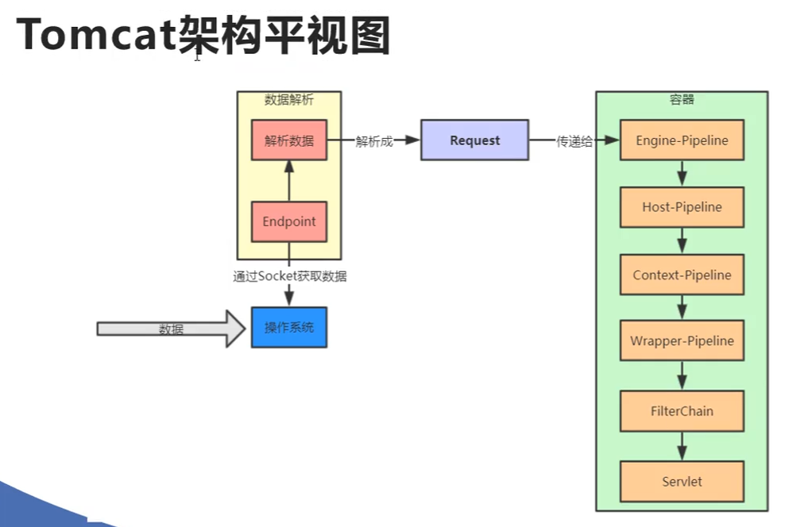

## Tomcat是一个Servlet容器

```code
class Tomcat {
    Connector connector;// 处理请求
    List<Servlet> servlets;// Servlet容器
}
```

## HttpServletRequest的实现

org.apache.catalina.connector.RequestFacade 使用门面模式  


## Tomcat中的4个容器：

org.apache.catalina.Container 的四个实现接口：
 - org.apache.catalina.Wrapper 代表一个Servlet类的类型.
 - org.apache.catalina.Context 应用，一个应用中有多个Servlet.
 - org.apache.catalina.Host 虚拟主机，其中包含多个Context.
 - org.apache.catalina.Engine 引擎，由多个Host组成.

对于每个容器，有个公共的组件管道org.apache.catalina.Pipeline  
管道之下还有阀门org.apache.catalina.Valve    

容器和阀门均可在conf\server.xml中定义

```code

Engine {
    Pipeline pipeline;// 管道
    List<Host> hosts;// 主机的集合
}

Host {
    Pipeline pipeline;// 管道
    List<Context> contexts;// 应用的集合
}

Context {
    Pipeline pipeline;// 管道
    List<Wrapper> wrappers;// Servlet类的类型
}

Wrapper {
    Pipeline pipeline;// 管道
    List<Servlet> servlet;// Servlet类的实例
}

Pipeline {
    List<Valve> valves;// 阀门
}
```

一个请求Request进来，经过 Engine->Host->Context->Wrapper->Servlet 路径，依次通过了各个管道的Valve之后，
最终调动Servlet.doGet方法

想知道Tomcat如何构建Servlet实例并调用它的doGet方法，应该从Wrapper的最后一个Valve入手。

org.apache.catalina.core.StandardWrapper 构造函数中，创建了  
org.apache.catalina.core.StandardWrapperValve#invoke

## 架构图



## 请求

浏览器：
 1. 构造数据，根据HTTP协议
 2. 建立TCP连接（Socket）
 3. 发送数据
 
Tomcat：
 1. 接收数据（从Socket中取数据）
 
 
org.apache.catalina.connector.Connector.getProtocol

创建协议
org.apache.coyote.ProtocolHandler.create


