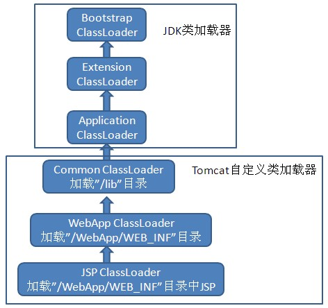

# 1. Tomcat底层架构

来源：https://www.bilibili.com/video/BV19E411j7cD

## 1.1 Tomcat是一个Servlet容器

```code
class Tomcat {
    Connector connector; // 处理请求
    Container Container; // Servlet容器
}
```

## 1.2 Tomcat中如何部署应用

部署war包：  
```java
/**
@see org.apache.catalina.startup.HostConfig#deployApps  
@see org.apache.catalina.startup.HostConfig#deployWARs
**/
```

## 1.3 Tomcat中的4个容器：

org.apache.catalina.Container 的四个实现接口：
 - org.apache.catalina.Engine 引擎，由多个Host组成.
 - org.apache.catalina.Host 虚拟主机，其中包含多个Context.
 - org.apache.catalina.Context 应用，一个应用中有多个Servlet.
 - org.apache.catalina.Wrapper 代表一个Servlet类的类型.

> Servlet到底是单例还是多例？  
https://www.cnblogs.com/softidea/p/7245899.html   
Servlet并不是单例，只是容器让它只实例化一次，表现出来的是单例的效果而已。  
在web.xml中声明了几次，即使同一个Servlet，如果声明多次，也会生成多个实例（实测如此）。   
是否实现SingleThreadModel(已经声明为废弃，官方不建议使用)，如果实现则最多会创建20个实例。
> - 单例：所有访问Servlet的请求共用同一个Servlet实例
> - 多例：每一访问Servlet的请求单独有一个Servlet实例


对于每个容器，有个公共的组件管道org.apache.catalina.Pipeline  
管道之下还有阀门org.apache.catalina.Valve    

容器和阀门均可在conf\server.xml中定义

```code

Engine {
    Pipeline pipeline;// 管道
    List<Host> hosts;// 主机的集合
}

Host {
    Pipeline pipeline;// 管道
    List<Context> contexts;// 应用的集合
}

Context {
    Pipeline pipeline;// 管道
    List<Wrapper> wrappers;// Servlet类的类型
}

Wrapper {
    Pipeline pipeline;// 管道
    List<Servlet> servlet;// Servlet类的实例，单个或多个
}

Pipeline {
    List<Valve> valves;// 阀门
}
```

StandardWrapper中，存储单个Servlet类型的实例、实例池：  
```java
/**@see org.apache.catalina.core.StandardWrapper**/
public class StandardWrapper {

    /**
     * The fully qualified servlet class name for this servlet.
     */
    protected String servletClass = null;
    
    /**
     * The (single) possibly uninitialized instance of this servlet.
     */
    protected volatile Servlet instance = null;
    
    /**
     * Stack containing the STM instances.
     */
    protected Stack<Servlet> instancePool = null;
    
    /**
     * Does this servlet implement the SingleThreadModel interface?
     */
    protected volatile boolean singleThreadModel = false;
    
    /**
     * Maximum number of STM instances.
     */
    protected int maxInstances = 20;
}
```


一个请求Request进来，经过 Engine->Host->Context->Wrapper->Servlet 路径，依次通过了各个管道的Valve之后，
最终调动Servlet.doGet方法。

想知道Tomcat如何构建Servlet实例并调用它的doGet方法，应该从Wrapper的最后一个Valve入手。

StandardWrapper构造函数中，创建了StandardWrapperValve：  
```java
/**
@see org.apache.catalina.core.StandardWrapper#StandardWrapper

public StandardWrapper() {

    super();
    swValve = new StandardWrapperValve();
    pipeline.setBasic(swValve);
    broadcaster = new NotificationBroadcasterSupport();

}
**/
```

## 1.4 架构图


# 2. Tomcat如何处理请求

## 2.1 HttpServletRequest的实现

```java
/**
@see org.apache.catalina.connector.RequestFacade 使用门面模式，实现Servlet规范，暴露给外部使用
@see org.apache.catalina.connector.Request 内部真正的实现
**/
```

## 2.2 处理请求

浏览器：
 1. 构造数据，根据HTTP协议
 2. 建立TCP连接（Socket）
 3. 发送数据
 
Tomcat：
 1. 客户端发出http请求至tomcat的连接监听端口；
 2. tomcat connector接收线程接收请求，并根据http协议解析该次请求；
 3. tomcat 通过解析的http报文，初始化org.apache.coyote.Request，并实例化org.apache.coyote.Response;
 4. 经装饰模式转化为servlet api对应的HttpServletRequest与HttpServletResponse;
 5. 经tomcat的层层容器engine、host、context最终到过我们所写的业务servlet的service方法；
 6. 业务方法service，处理相关的业务逻辑，写入相应的响应的至response，并返回tomcat的容器组件；
 7. tomcat该处理线程关闭响应流Response，并将响应内容返回客户端;
 8. tomcat该处理线程被释放，然后用于下次请求的处理;


IO模型：NIO、BIO(tomcat9不再支持)  
 
Connector从Socket中取数据，再根据HTTP协议构造Request对象 

创建协议  
```java
/**
@see org.apache.catalina.connector.Connector#Connector(java.lang.String)  
@see org.apache.coyote.ProtocolHandler#create  
**/
```

org.apache.coyote.http11.Http11NioProtocol 代表HTTP1.1协议，使用NIO模型
 
### 2.2.1 启动HTTP服务，绑定端口 

```java
/**
@see org.apache.catalina.startup.Bootstrap#load  
@see org.apache.catalina.startup.Catalina#load  
@see org.apache.catalina.util.LifecycleBase#init   
@see org.apache.catalina.core.StandardServer#initInternal  
@see org.apache.catalina.connector.Connector#initInternal  
@see org.apache.coyote.AbstractProtocol#init  
@see org.apache.tomcat.util.net.AbstractEndpoint#init  
@see org.apache.tomcat.util.net.NioEndpoint#bind   

绑定8080端口  
@see org.apache.tomcat.util.net.NioEndpoint#initServerSocket  

ServerSocketChannel serverSock = ServerSocketChannel.open();
socketProperties.setProperties(serverSock.socket());
InetSocketAddress addr = new InetSocketAddress(getAddress(), getPortWithOffset());
serverSock.socket().bind(addr,getAcceptCount());

**/
```

### 2.2.2 启动HTTP服务，监听请求

```java
/**
@see org.apache.catalina.startup.Bootstrap#start  
@see org.apache.catalina.startup.Catalina#start  
@see org.apache.catalina.core.StandardServer#startInternal  
@see org.apache.coyote.AbstractProtocol#start  
@see org.apache.tomcat.util.net.NioEndpoint#startInternal  

其中，启动两个线程    
@see org.apache.tomcat.util.net.NioEndpoint.Poller#run  
@see org.apache.tomcat.util.net.Acceptor#run  
**/
```

#### A. 监听Socket

侦听对此套接字的连接并接受它。该方法将阻塞，直到建立连接：
```java
/**
@see org.apache.tomcat.util.net.Acceptor#run  
@see org.apache.tomcat.util.net.NioEndpoint#serverSocketAccept  

SocketChannel socket = serverSock.accept();

**/
```

#### B. 轮询Channel  

```java
/**
@see org.apache.tomcat.util.net.NioEndpoint.Poller#run  

int keyCount = selector.select(selectorTimeout);
Iterator<SelectionKey> iterator = keyCount > 0 ? selector.selectedKeys().iterator() : null;
SelectionKey sk = iterator.next();
NioSocketWrapper socketWrapper = (NioSocketWrapper) sk.attachment();
processKey(sk, socketWrapper);

**/
```

### 2.2.3 接收请求

建立连接后，处理Socket读写   
```java
/**
@see org.apache.tomcat.util.net.NioEndpoint.Poller#processKey  
@see org.apache.tomcat.util.net.AbstractEndpoint#processSocket  
**/
```

- 重要代码 

在线程池中，从Socket中读取数据  
```java
/**
@see org.apache.tomcat.util.net.NioEndpoint.SocketProcessor#doRun  
@see org.apache.coyote.AbstractProtocol.ConnectionHandler#process  
@see org.apache.coyote.AbstractProcessorLight#process  
**/
```

 - 重要代码 

读取HTTP请求行、请求头  
注意，处理协议的时候，用的请求对象是org.apache.coyote.Request
```java
/**
@see org.apache.coyote.http11.Http11Processor#service

inputBuffer.parseRequestLine(keptAlive, protocol.getConnectionTimeout(), protocol.getKeepAliveTimeout()); // 解析请求行
inputBuffer.parseHeaders(); // 解析请求头
getAdapter().service(request, response);// 将请求传递给Servlet容器

**/
```

 - 重要代码 

其中将请求传递给Servlet容器：Engine->Host->Context->Wrapper  
注意，这里会将请求对象由org.apache.coyote.Request转换为org.apache.catalina.connector.Request
```java
/**
@see org.apache.catalina.connector.CoyoteAdapter#service
**/
```

 - 重要代码

到达Wrapper容器的最后一个valve，执行servlet实例方法    
注意，这里调用servlet过滤器链的时候，将请求对象由org.apache.catalina.connector.Request转换为org.apache.catalina.connector.RequestFacade
```java
/**
@see org.apache.catalina.core.StandardWrapperValve#invoke
@see org.apache.catalina.core.ApplicationFilterChain#doFilter
**/
```

> 注：重要代码在下文中会继续讲解到。

> Servlet和Filter的执行顺序  
> https://blog.csdn.net/weixin_43343423/article/details/91194399  
> org.apache.catalina.core.ApplicationFilterChain#internalDoFilter

### 2.2.4 生成Servlet

项目启动的时候，生成servlet实例，后续请求都不会生成实例  
```java
/**
@see org.apache.catalina.startup.HostConfig#deployApps()  
@see org.apache.catalina.startup.HostConfig#deployDirectories  
@see org.apache.catalina.startup.HostConfig.DeployDirectory#run  
@see org.apache.catalina.core.StandardHost#addChild  
@see org.apache.catalina.core.StandardContext#startInternal  
@see org.apache.catalina.core.StandardWrapper#load  
@see org.apache.catalina.core.StandardWrapper#loadServlet  

Servlet servlet = (Servlet) instanceManager.newInstance(servletClass);// 创建实例
initServlet(servlet);// 调用Servlet.init方法

**/
```

### 2.2.5 Tomcat如何维护请求地址与Servlet类的映射关系？

如何根据请求地址，找到对应的Wrapper？  

在web.xml文件中配置Servlet与请求地址的映射关系：  
```xml
<web-app>
  <servlet>
    <servlet-name>ServletDemo</servlet-name>
    <servlet-class>servlet.ServletDemo</servlet-class>
  </servlet>
  <servlet-mapping>
    <servlet-name>ServletDemo</servlet-name>
    <url-pattern>/servlet/ServletDemo</url-pattern>
  </servlet-mapping>
</web-app>
```

#### A.请求在容器中的传递

为请求设置容器，并依次执行各个容器。  
注意，这里处理了 org.apache.catalina.connector.Request 和 org.apache.coyote.Request 之间的转换关系：
```java
/**
@see org.apache.catalina.connector.CoyoteAdapter#service

boolean postParseSuccess = false;
// 前置处理请求，为请求org.apache.catalina.connector.Request设置对应的host、context、wrapper容器
postParseSuccess = postParseRequest(req, request, res, response);
// 取得Engine容器，依次执行它的valve
connector.getService().getContainer().getPipeline().getFirst().invoke(request, response);

**/
```

经历各个pipeline的valve
```java
/**
@see org.apache.catalina.core.StandardEngineValve#invoke  

// Select the Host to be used for this Request
Host host = request.getHost();
// Ask this Host to process this request
host.getPipeline().getFirst().invoke(request, response);


@see org.apache.catalina.core.StandardHostValve#invoke  

// Select the Context to be used for this Request
Context context = request.getContext();
context.getPipeline().getFirst().invoke(request, response);


@see org.apache.catalina.core.StandardContextValve#invoke  

// Select the Wrapper to be used for this Request 
// 最终将请求传递给Wrapper  
Wrapper wrapper = request.getWrapper();
// 从Wrapper的pipeline中取出第一个valve，将请求传递过去
wrapper.getPipeline().getFirst().invoke(request, response);

**/
```

#### B.具体是什么时候在Request对象中设置容器的呢？  

```java
/**
在处理请求的时候，将请求交给容器之前，首先为请求设置容器对象：  
@see org.apache.coyote.http11.Http11Processor#service  
@see org.apache.catalina.connector.CoyoteAdapter#service  
@see org.apache.catalina.connector.CoyoteAdapter#postParseRequest  

为请求设置Host、Context容器：  
@see org.apache.catalina.mapper.Mapper#internalMap  

为请求设置Wrapper容器（通过请求路径匹配）：  
@see org.apache.catalina.mapper.Mapper#internalMapWrapper   
@see org.apache.catalina.mapper.Mapper#internalMapExactWrapper  
**/
```


# 3. Servlet

## 3.1 servlet生命周期


来源：https://www.bilibili.com/video/BV13E41137Bv

## 3.2 异步处理请求

### 3.1.1 如何使用异步

```code
AsyncContext asyncContext = req.startAsync();
asyncContext.start(new Runnable(){...})// 另启线程执行任务
```

总体思想是，将request、response对象设置在上下文AsyncContext之中，并通过上下文传递给子线程，由子线程去执行耗时任务。    

```java
/**
@see org.apache.catalina.connector.Request#startAsync()
@see org.apache.catalina.core.AsyncContextImpl#start  

public void start(final Runnable run) {
    check();
    Runnable wrapper = new RunnableWrapper(run, context, this.request.getCoyoteRequest());
    this.request.getCoyoteRequest().action(ActionCode.ASYNC_RUN, wrapper);
}


@see org.apache.coyote.AbstractProcessor#action

case ASYNC_RUN: {
    asyncStateMachine.asyncRun((Runnable) param);
    break;
}


@see org.apache.coyote.AsyncStateMachine#asyncRun

processor.execute(runnable);

**/
```

Tomcat使用线程池配置高并发连接  
https://www.cnblogs.com/chengssblog/p/6635211.html

tomcat结合servlet3异步化的整体请求处理过程大致如下：

 1. 客户端发出http请求至tomcat的连接监听端口；
 2. tomcat connector接收线程接收请求，并根据http协议解析该次请求；
 3. tomcat 通过解析的http报文，实例化org.apache.coyote.Request，并实例化org.apache.coyote.Response;
 4. 经装饰模式转化为servlet api对应的HttpServletRequest与HttpServletReponse;
 5. 经tomcat的层层容器engine,host,context最终到过我们所写的业务servlet的service方法；
 6. 业务方法开启异步化上下文AsyncContext;释放tomcat当前处理线程；
 7. tomcat判断当前请求是否开启了异步化，如果开启则不关闭响应流Response，也不进行用户响应的返回;
 8. tomcat该线程被释放，然后用于下次请求的处理，提高其吞吐量;
 9. 业务方法在AsyncContext环境中完成业务方法的处理，调用其complete方法，将响应写回响应流，并关闭响应流，完成此次请求处理.

提前释放tomcat的处理线程，是为了让tomcat的线程使用率更高，提高吞吐量；  
不关闭响应流为的是我们在业务中处理了占用长时间的业务操作之后，自己进行响应流的返回并进行关闭。  
响应时间并没有加快，还是会取决于我们的业务逻辑。默认超时时间是30S，也就是说异步处理逻辑超过30S后就会报错。

来源：https://blog.csdn.net/zhurhyme/article/details/76228836

### 3.1.2 子线程执行完成后的处理
  
```code
asyncContext.complete();// 设置任务执行完成状态
```

设置任务执行完成状态，这里最终会调用AbstractEndpoint的processSocket方法，EndPoint是用来接受和处理请求的。 
```java
/**
@see org.apache.catalina.core.AsyncContextImpl#complete

request.getCoyoteRequest().action(ActionCode.ASYNC_COMPLETE, null);


@see org.apache.coyote.AbstractProcessor#action

case ASYNC_COMPLETE: {
    clearDispatches();
    if (asyncStateMachine.asyncComplete()) { // 状态由 AsyncState.STARTED 转换为 AsyncState.COMPLETING，后续可满足触发AsyncContext.fireOnComplete
        processSocketEvent(SocketEvent.OPEN_READ, true); // 处理socket
    }
    break;
}


@see org.apache.tomcat.util.net.AbstractEndpoint#processSocket  

SocketProcessorBase<S> sc = processorCache.pop();
Executor executor = getExecutor();
if (dispatch && executor != null) {
    executor.execute(sc);// 在线程池中处理Socket
}

**/
```

接下来就会交给Processor去进行协议处理。  
这部分是重点，AbstractProcessorLight会根据SocketEvent的状态来判断调用逻辑。  
因为当前请求是执行完成后调用的，肯定不能调用service方法进容器了，不然就是死循环了，这里通过isAsync()判断，就会进入dispatch(status)。
```java
/**
@see org.apache.coyote.AbstractProcessorLight#process  

else if (isAsync() || isUpgrade() || state == SocketState.ASYNC_END) {
    state = dispatch(status); // 处理异步请求，即通过asyncContext.complete()会执行到这里
    state = checkForPipelinedData(state, socketWrapper);
} else if (status == SocketEvent.OPEN_READ) {
    state = service(socketWrapper); // 处理同步请求：从Socket中取数据，构建Request对象，调用容器执行Servlet等
}

if (isAsync()) {
    state = asyncPostProcess();// 处理异步流程，比如调用监听子线程的listener方法
}

**/
```
注意到AbstractProcessorLight#process之中有个do-while循环，实际上会两次会进入dispatch方法。


### 3.1.2 A.第一次进入dispatch  

此时isAsync==true，进入dispatch方法：
```java
/**
@see org.apache.coyote.AbstractProcessorLight#process  

if (isAsync() || isUpgrade() || state == SocketState.ASYNC_END) {
    state = dispatch(status); // 第一次进入这里，并没有处理什么逻辑
    state = checkForPipelinedData(state, socketWrapper);
}

**/
```

由于给asyncContext添加监听器：  
```code
asyncContext.addListener(new AsyncListener(){...})
```

因此会调用到监听器：
```java
/**
@see org.apache.coyote.AbstractProcessorLight#process 

if (isAsync()) {
    state = asyncPostProcess();// 处理异步流程，比如调用监听子线程的listener方法
}


@see org.apache.coyote.AsyncStateMachine#asyncPostProcess  

if (state == AsyncState.MUST_COMPLETE || state == AsyncState.COMPLETING) { // asyncContext.complete 中设置状态
    asyncCtxt.fireOnComplete();// 监听到子线程执行完毕了，调用listener.complete方法
    state = AsyncState.DISPATCHED;// 这里把request.isAsync设置为false!!!
    return SocketState.ASYNC_END;// 设置socketState
}

最终调到用户代码：
@see org.apache.catalina.core.AsyncContextImpl#fireOnComplete  
@see org.apache.catalina.core.AsyncListenerWrapper#fireOnComplete  

**/
```

### 3.1.2 B.第二次进入dispatch  

此时isAsync==false && state == SocketState.ASYNC_END，进入dispatch方法：
```java
/**
@see org.apache.coyote.AbstractProcessorLight#process  

if (isAsync() || isUpgrade() || state == SocketState.ASYNC_END) {
    state = dispatch(status); // 第二次进入dispatch，将response写到浏览器
    state = checkForPipelinedData(state, socketWrapper);
}

**/
```

最终会调用CoyoteAdapter的asyncDispatch方法，完成了数据的输出，最终输出到浏览器。  
```java
/**
@see org.apache.catalina.connector.CoyoteAdapter#asyncDispatch  

if (!request.isAsync()) {
    request.finishRequest();
    response.finishResponse(); // 写数据到浏览器
}

if (!success || !request.isAsync()) {
    updateWrapperErrorCount(request, response);
    request.recycle(); // 销毁request和response
    response.recycle();
}

**/
```

### 3.1.3 聊聊异步Servlet的使用场景

分析了这么多，那么异步Servlet的使用场景有哪些呢？其实我们只要抓住一点就可以分析了，就是异步Servlet提高了系统的吞吐量，可以接受更多的请求。假设web系统中Tomcat的线程不够用了，大量请求在等待，而此时Web系统应用层面的优化已经不能再优化了，也就是无法缩短业务逻辑的响应时间了，这个时候，如果想让减少用户的等待时间，提高吞吐量，可以尝试下使用异步Servlet。

举一个实际的例子：比如做一个短信系统，短信系统对实时性要求很高，所以要求等待时间尽可能短，而发送功能我们实际上是委托运营商去发送的，也就是说我们要调用接口，假设并发量很高，那么这个时候业务系统调用我们的发送短信功能，就有可能把我们的Tomcat线程池用完，剩下的请求就会在队列中等待，那这个时候，短信的延时就上去了，为了解决这个问题，我们可以引入异步Servlet,接受更多的短信发送请求，从而减少短信的延时。

由于涉及线程间的交互，且有超时时间限制，实际运用上，可用消息队列替代。

来源：https://my.oschina.net/luozhou/blog/3116782

# 4. Session和Cookie

## 4.1 介绍和使用

https://www.cnblogs.com/cqming/p/10846726.html

Cookie：在浏览器中保存用户的信息

使用：由服务器创建，发送到浏览器保存，之后随着请求发回到服务器
1.创建cookie
Cookie cookie = new Cookie("name","value");
2.发送cookie到浏览器
response.addCookie(cookie对象);
3.获取来自客户端的cookie
Cookie[] cookies = request.getCookies();

使用注意：
1.cookie第一次是由servlet发送到浏览器中，第一次不能获取cookie
2.不同的浏览器存放的cookie不是同一个
3.如果设置了cookie的maxage，则cookie会保存在浏览器所在电脑的硬盘上，如果没设置该属性，则保存在浏览器的内存中


Session：在服务器中保存用户信息
使用：在服务器端创建Session，来保存当前访问服务器的用户的信息
1.获取session（如果已经创建了session，则返回当前session）或创建session：
HttpSession session = request.getSession();
2.设置session最大不活跃时间
session.setMaxInactiveInteval() //以秒为单位
3.使用session保存信息
session.setAttribute(String key,Object value);
session.getAttribute(String key);
4.立即销毁session
session.invalidate();

## 4.2 分析

### 第一次访问
HttpSession session = req.getSession();

此时Cookie为空，进入代码:
```java
/**
@see org.apache.catalina.connector.RequestFacade#getSession(boolean)
@see org.apache.catalina.connector.Request#getSession(boolean)

// 此时boolean create == true
public HttpSession getSession(boolean create) {
    Session session = doGetSession(create);
    if (session == null) {
        return null;
    }
    return session.getSession();
}

@see org.apache.catalina.connector.Request#doGetSession

由于 requestedSessionId == null
执行 session = manager.createSession(sessionId); 且 sessionId == null
进入
@see org.apache.catalina.session.ManagerBase#createSession

创建完Session后，回到
@see org.apache.catalina.connector.Request#doGetSession

// Creating a new session cookie based on that session
if (session != null && trackModesIncludesCookie) {
    Cookie cookie = ApplicationSessionCookieConfig.createSessionCookie(
            context, session.getIdInternal(), isSecure());
    response.addSessionCookieInternal(cookie);
}

**/
```

响应结果：  
Set-Cookie: JSESSIONID=9BC58EF48016F804CAE79C47B3E53030; Path=/servlet-demo; HttpOnly

### 第二次访问
HttpSession session = req.getSession();

此时具有Cookie如下   
Cookie: JSESSIONID=9BC58EF48016F804CAE79C47B3E53030
```java
/**
@see org.apache.catalina.connector.Request#doGetSession

session = manager.findSession(requestedSessionId);

由于requestedSessionId不为空，即可根据sessionId找到对应的Session对象

**/
```

## 4.3 总结

在RPC无状态服务中，不使用session，以请求中带的cookie为准。  
例如两次请求的sessionId一样，但是cookie中携带了userId不同，依旧是代表两个不同的用户的访问会话。  


# 7. Tomcat自定义类加载器

来源：https://www.bilibili.com/video/BV11g4y1q7fb

## 7.1 类加载过程：

1. 加载class文件到JVM（染色体）
2. 校验
3. 准备（Java内存模型）（申请肚子）
4. 解析（接口、方法、字段）
5. 初始化（静态变量、静态方法块）
6. 使用（new对象）
7. 销毁

## 7.2 类加载器

为每个应用生成不同的WebappClassLoader实例 

Tomcat平台 -----> commonClassLoader   
应用A:com.sumkor.Test -----> WebappClassLoader  
应用B:com.sumkor.Test -----> WebappClassLoader  
 
Tomcat5的类加载体系结构如下：


Tomcat6的类加载体系结构如下：



《深入理解Java虚拟机》  
9.2.1　Tomcat：正统的类加载器架构  
所以Tomcat 6之后也顺理成章地把/common、/server和/shared这3个目录默认合并到一起变成1个/lib目录，这个目录里的类库
相当于以前/common目录中类库的作用  

java.net.URLClassLoader作用在于，可以通过URL资源地址，去加载指定路径下的类文件。  


初始化Tomcat自身的类加载器： 
```java
/**
@see org.apache.catalina.startup.Bootstrap#initClassLoaders  

ClassLoader commonLoader = null;
ClassLoader catalinaLoader = null;
ClassLoader sharedLoader = null;

private void initClassLoaders() {
    try {
        commonLoader = createClassLoader("common", null);
        if (commonLoader == null) {
            // no config file, default to this loader - we might be in a 'single' env.
            commonLoader = this.getClass().getClassLoader();
        }
        catalinaLoader = createClassLoader("server", commonLoader);
        sharedLoader = createClassLoader("shared", commonLoader);
    } catch (Throwable t) {
        handleThrowable(t);
        log.error("Class loader creation threw exception", t);
        System.exit(1);
    }
}

**/
```

自定义webapp类加载器：  
org.apache.catalina.loader.WebappClassLoader  

具体实现：
```java
/**
@see org.apache.catalina.loader.WebappClassLoaderBase#loadClass(java.lang.String, boolean) 

1. 先检查该类是否已经被webapp类加载器加载过
2. 尝试通过系统类加载器（AppClassLoader）加载类，避免webapp重写JDK中的类。即双亲委派
3. 判断是否委派给父类加载器加载
4. 使用webApp类加载器，自行加载
5. 如果webApp应用内部没有加载到该类，且父类加载器没有加载过该类，则无条件委托给父类加载器加载
6. 最终还是加载不到该类，则抛出异常

**/
```

## 7.3 热部署

主体：Host  
配置：server.xml的Host标签配置autoDeploy="true"  
触发条件：在webapp目录下放入新的web应用，或者在webapp目录下移除web项目，或者修改了Context的属性？      
结果，触发Host重新部署或取消部署Context  

https://www.cnblogs.com/Marydon20170307/p/7141784.html

## 7.4 热加载

主体：Context   
配置：server.xml的Context标签的reloadable为true
触发条件：WEB-INF目录下类文件的修改时间有变动，或者jar文件增加、修改、删除    
结果：触发Context重新加载类  

注意，增加类文件不会立即触发重新加载，因为类加载是按需加载   

热加载实现：  
```java
/**
@see org.apache.catalina.loader.WebappLoader#backgroundProcess  
@see org.apache.catalina.loader.WebappClassLoaderBase#modified   
**/
```

热加载，需要想办法将旧的class对象，从jvm中卸载掉。  
把用到旧class对象的线程停掉，触发jvm执行垃圾回收。但是很难被回收，结果会导致jvm中的对象越来越多。  

## 7.5 JSP热加载

```java
/**
@see org.apache.jasper.servlet.JspServletWrapper#service
**/
```

1. 根据url地址，定位jsp文件，编译成class文件  
org.apache.jasper.JspCompilationContext.compile
2. 重新加载class文件（卸载旧的类加载器，使用新的类加载器来加载）  
org.apache.jasper.servlet.JspServletWrapper.getServlet
3. 使用新的Servlet来处理请求


来源：https://www.bilibili.com/video/BV16W411A7wE?p=5

# 8. embed-tomcat

Springboot中启动内嵌的tomcat

执行Springboot的run方法  
org.springframework.boot.SpringApplication#run(java.lang.String...)  
org.springframework.boot.SpringApplication#refreshContext  

进入到Spring context的refresh方法  
org.springframework.context.support.AbstractApplicationContext#refresh  
org.springframework.context.support.AbstractApplicationContext#onRefresh  

回到Springboot实现的onRefresh方法  
org.springframework.boot.web.servlet.context.ServletWebServerApplicationContext#onRefresh  
org.springframework.boot.web.servlet.context.ServletWebServerApplicationContext#createWebServer  

创建Tomcat容器  
org.springframework.boot.web.embedded.tomcat.TomcatServletWebServerFactory#getWebServer  
```java
public class TomcatServletWebServerFactory {
	@Override
	public WebServer getWebServer(ServletContextInitializer... initializers) {
		Tomcat tomcat = new Tomcat();
		File baseDir = (this.baseDirectory != null) ? this.baseDirectory
				: createTempDir("tomcat");
		tomcat.setBaseDir(baseDir.getAbsolutePath());
		Connector connector = new Connector(this.protocol);
		tomcat.getService().addConnector(connector);
		customizeConnector(connector);
		tomcat.setConnector(connector);
		tomcat.getHost().setAutoDeploy(false);
		configureEngine(tomcat.getEngine());
		for (Connector additionalConnector : this.additionalTomcatConnectors) {
			tomcat.getService().addConnector(additionalConnector);
		}
		prepareContext(tomcat.getHost(), initializers);
		return getTomcatWebServer(tomcat);
	}
}
```